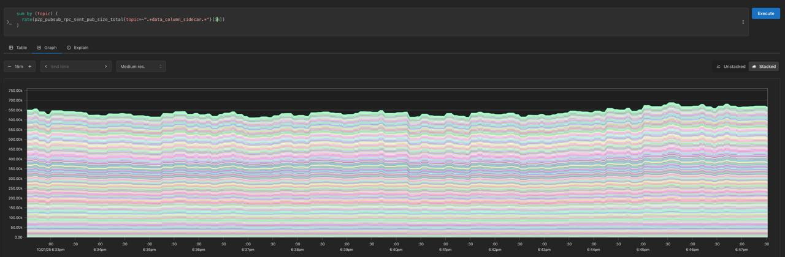
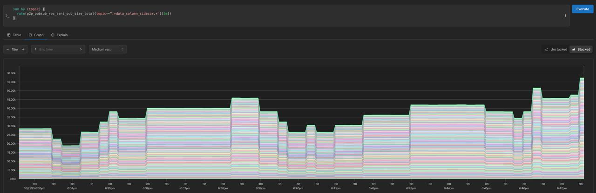

PeerDAS cell-level deltas
---

## Overview TLDR

- A CL network optimization that eliminates the need to transmit redundant column data during the slot critical path.
- Leverages partial blob data available in the EL blobpool.
- Nodes construct columns by exchanging and reconciling cells with one another.
- Implemented as a Gossipsub extension titled "Partial messages".
- Backwards compatible, no consensus impact, deployable gradually & ex-fork.

## Motivation

- Unlocks the next tranche of BPOs, allowing us to go from 21 max to 72 blobs max at least (could go beyond, depends on stress testing).
- Beyond that, we'll be next constrained bandwidth-wise by the EL blobpool (=> EL sparse blobpool EIP PFI'ed for Glamsterdam)

## Early results preview

Shows early promise of average 10x traffic reduction during column propagation (with current rate of public vs. unseen blobs).

Supernode before _(data sent on column subnets; Y range: 0-750KiB)_

Supernode after _(data sent on column subnets; Y range: 0-50KiB)_

## Current status

- Prysm prototype ready and in review (thanks @kasey!)
- Lighthouse implementation underway (thanks Daniel + João!)

## References (please review if you haven't)

- https://ethresear.ch/t/gossipsubs-partial-messages-extension-and-cell-level-dissemination/23017
- https://github.com/ethereum/consensus-specs/pull/4558
- https://github.com/libp2p/specs/pull/685

<!-- end_slide -->

BPO schedules
---

### Current BPO schedule :: `BPO[planned]`

| Fork       | Target | Max  |
| :--------- | :----- | :--- |
| **Fusaka** | `6`    | `9`  |
| **BPO1**   | `10`   | `15` |
| **BPO2**   | `14`   | `21` |

### Potential next BPO schedule :: `BPO[next]`

| Fork     | Target | Max  | Mainnet deployment | Notes                                                  |
| :------- | :----- | :--- | ------------------ | ------------------------------------------------------ |
| **BPO3** | `18`   | `24` | Feb'26             | Small parameter bump to ensure all looks nominal       |
| **BPO4** | `24`   | `32` | Mar'26             | Probes for bigger increments by enabling larger spikes |
| **BPO5** | `32`   | `48` | Mar'26             |                                                        |
| **BPO6** | `48`   | `64` | Apr'26             |                                                        |
| **BPO7** | `64`   | `72` | Apr'26             |                                                        |

<!-- end_slide -->

Indicative timeline
---

| Phase              | Status      | Milestone                                                   | Date           | Teams            |
| :----------------- | ----------- | ----------------------------------------------------------- | -------------- | ---------------- |
| **Prototyping**    | Done        | First version of design made public                         | September 2025 | P2P              |
|                    | Done        | Prysm prototype ready                                       | October 2025   | P2P              |
|                    | Done        | First tests in devnets                                      | October 2025   | P2P              |
| **Implementation** | In progress | Lighthouse in development                                   | October 2025   | SP               |
|                    | In progress | Larger devnet tests                                         | October 2025   | P2P, SSL         |
|                    |             | Interop in even larger devnets (Prysm + Lighthouse)         | November 2025  | SSL, PO, P2P, SP |
|                    |             | Iteration and refinements                                   | November 2025  | P2P, SP          |
|                    |             | Publish final design + results                              | November 2025  | P2P              |
|                    |             | Engine API GetBlobsV3 shipped in all execution clients (\*) | November 2025  | P2P, EL          |
|                    |             | Nimbus / Teku / Lodestar begin implementation               | November 2025  | ST, CON, CS      |
|                    |             | Nimbus / Teku / Lodestar implementations ready              | December 2025  | ST, CON, CS      |
|                    |             | Prysm and Lighthouse production-grade                       | December 2025  | P2P, SP          |
| **Testing**        |             | Full interop and devnets battletesting                      | December 2025  | Everyone         |
|                    |             | 2 week buffer for fixes                                     | December 2025  | Everyone         |
|                    |             | `BPO[next]` schedule proposed                               | December 2025  | P2P              |
| **Deployment**     |             | `BPO[next]` schedule committed                              | January 2026   | Everyone         |
|                    |             | All CL client releases shipped                              | January 2025   | Everyone         |
|                    |             | `BPO[next]` // Sepolia                                      | + 1 week       | Everyone         |
|                    |             | `BPO[next]` // Hoodi                                        | + 2 weeks      | Everyone         |
| **Mainnet**        |             | BPO3 activates                                              | 2026-02-14     |                  |
|                    |             | BPO4 activates                                              | 2026-03-01     |                  |
|                    |             | BPO5 activates                                              | 2026-03-15     |                  |
|                    |             | BPO6 activates                                              | 2026-04-01     |                  |
|                    |             | BPO7 activates                                              | 2026-04-30     |                  |

(\*) Abandoned PRs already exist for most implementations.

> Team legend
>
> - `P2P`: EF P2P Networking team
> - `SP`: Sigma Prime
> - `OFL`: Offchain Labs
> - `SSL`: Sunnyside Labs
> - `PO`: PandaOps
> - `EL`: All EL teams
> - `ST`: Status
> - `CON`: ConsenSys
> - `CS`: ChainSafe

<!-- end_slide -->

What's next?
---

## Next steps

- Larger testnets + battletesting with Sunny Side Labs and EthPandaOps.
- Interop tests Prysm <> Lighthouse.

## Asks

- CL implementers: please review, comment on specs, and start planning implementation.
- EL implementers: get ready to rehash `getBlobsV3`.
